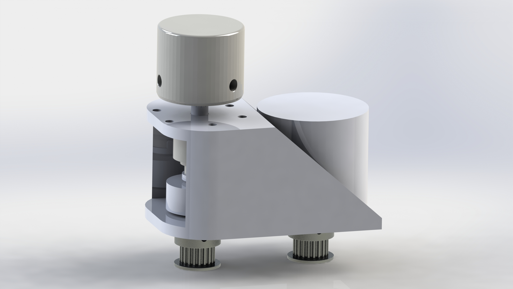
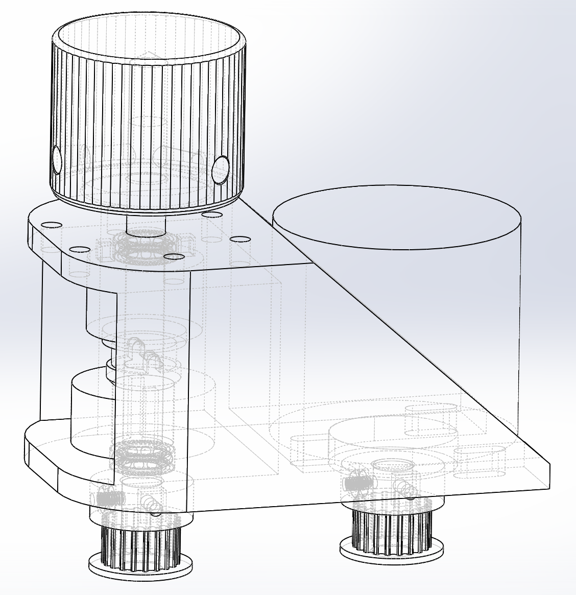

# SDVX-aclike-knobs-on-yuancon
Project to add TOK TLE1-618-5W torque limiters into a Yuancon's height restrictions

Things to know about belt_v2:
As of this writing on 2021/11/11 it is UNTESTED.  I just placed orders for these parts today due to the 11/11 sale so it may take some time to get parts in.

Each assembly requires:  
1x 3D printed mount(FDM)  
1x 3D printed pin_collar_v2(FDM)  
1x TLE1-618-5W https://yubiparts.com/products/tok-tle1-618-5w-torque-limiters-for-sound-voltex-sdvx?variant=41889400914107  
2x 106 bearings - remains to be seen if flanged versions are needed  
1x 0.375in clamp collar https://www.aliexpress.com/item/4001149658372.html?spm=a2g0s.9042311.0.0.3a354c4dJLlZLb  
1x 6x70mm metal shaft/dowel  
1x Chinese encoder - purchase a new one because yuancon ones have the metal lip which increases height and therefore probably isn't compatible.  Use it in cheaper cons, it's still a good encoder/knob solution.  
1x Knob https://www.speedylabs.shop/product/sound-voltex-aluminum-yuancon-diy-knob/  
4x m2 hex nut  
4x m2x4 set screw  
2x 3D printed GT2 pulleys(Resin or FDM).  Most GT2 pulleys for 3D printers are 5 or 8mm bore, but our encoder and shaft both use a 6mm.  Thus a custom solution is needed.   
1x GT2 closed loop Belt.  Rough calculations bring the needed length to around 120mm, and 122mm seems to be fairly readily available.  
6x m3 nuts - 3 for mounting the encoder, 3 for mounting the assembly to the controller  
3x m3 nuts - to secure the assembly to the controller  

Things to consider:  
1x 6mm collar clamp/lock collar/drillstop under the knob to stop downwards force from applying pressure to the torque limiter
