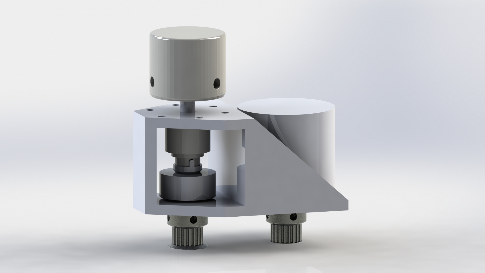
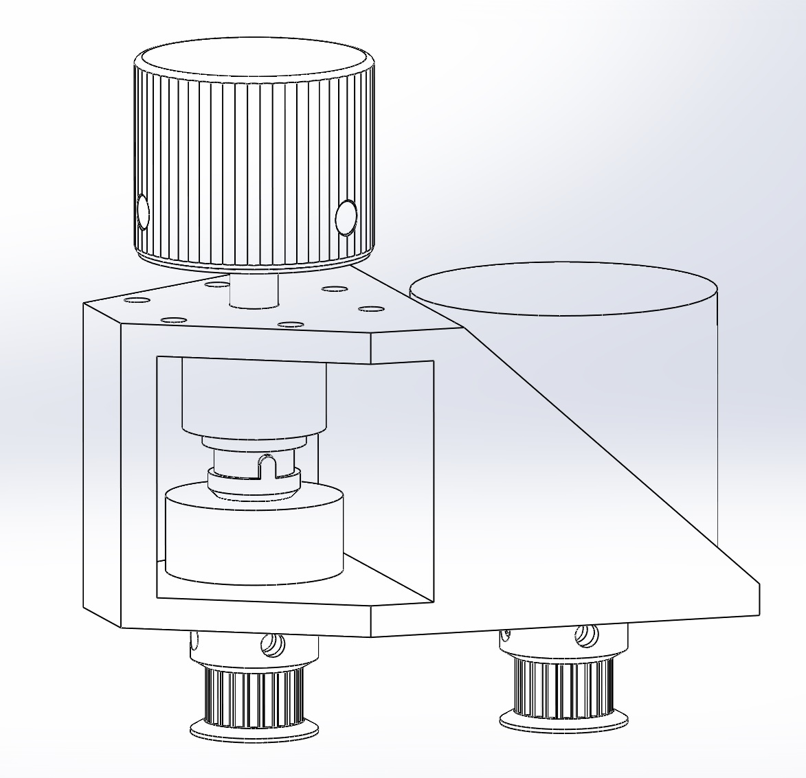

# SDVX-aclike-knobs-on-yuancon
Project to add TOK TLE1-618-5W torque limiters into a Yuancon's SDVX 2019 height restrictions.  WILL PROBABLY NOT FIT ON GEN 12 DUE TO LED STRIP!!!

As of 2022/01/10 belt_v2_2 has been installed successfully in my Yuancon SDVX 2019.

mount print orientation is pointy side up

Each assembly requires:  
1x 3D printed mount(FDM)  
1x 3D printed pin_collar_v2(FDM)  
1x TLE1-618-5W https://yubiparts.com/products/tok-tle1-618-5w-torque-limiters-for-sound-voltex-sdvx?variant=41889400914107  
2x 106 bearings - remains to be seen if flanged versions are needed   [update: i used 1 flanged on the bottom, 1 non flanged up top.  Could probably just use non-flanged for both just fine though]  
1x 0.375in clamp collar https://www.aliexpress.com/item/4001149658372.html?spm=a2g0s.9042311.0.0.3a354c4dJLlZLb  
1x 6x70mm metal shaft/dowel  
1x Chinese encoder - purchase a new one because yuancon ones have the metal lip which increases height and therefore probably isn't compatible.  Use it in cheaper cons, it's still a good encoder/knob solution.  
1x Knob https://www.speedylabs.us/product/sound-voltex-aluminum-yuancon-diy-knob/  
4x m3 hex nut - insert into gt2 pulley  
2x 3D printed GT2 pulleys(Resin or FDM).  Most GT2 pulleys for 3D printers are 5 or 8mm bore, but our encoder and shaft both use a 6mm.  Thus a custom solution is needed.   
1x GT2 closed loop Belt.  Rough calculations bring the needed length to around 120mm, and 122mm seems to be fairly readily available.  
7x m3x8 screws - 3 for mounting the encoder, 4 for GT2 pulleys(2 each)  
3x m3 nuts - to secure the assembly to the controller  
1x 6mm lock collar under the knob to stop downwards force from applying pressure to the torque limiter  

reuse the 3 flush m3 screws that yuan uses for mounting the encoder to mount the assembly

General assembly instructions(assuming acrylic is removed and no encoders installed):  
1. Insert m3 nuts into GT2 pulleys, and insert m3 screw into the holes.  
2. Take printed mount and metal shaft.  Carefully rotate and wear in/enlargen the top and bottom mount holes until the rod can slip through both holes and spin freely.  
3. Insert bearing on top, and repeat above procedure with bearing.  Repeat on bottom.  Shaft should spin pretty well with both bearings fitted and shaft going through both bearings/holes.  
4. Pull out rod until it's just barely through the top bearing.  Put in torque limiter from side, and push the tabs into their holes.  Push metal rod through the torque limiter.  
5. Insert pin_collar_v2 from the side, aligning the tabs with the torque limiter.  Once aligned, push shaft down through the pin collar and through the bottom bearing/hole.  
6. Use the 0.375in clamp collar and clamp down the pin_collar_v2, making sure to line up the side slits of pin_collar_v2 with the clamp collar.  
7. Install gt2 pulley on the 6mm shaft, feel free to push the rod all the way flush to the bottom of the gt2 pulley.  Use 4 pieces of paper to shim the area between the gt2 pulley and the bottom of the mount before securing both m3 screws on the pulley.  
8. Before removing the 4 pieces of paper shim, slide a 6mm lock collar on the top part of the mount and secure it tightly.  Remove the paper shims after this lock collar is installed.  The shaft should now not move up or down due to the lock collar up top and the pulley on the bottom.  
9. Mount the encoder with the 3 m3 screws, leaving them a little loose for the motor to slide back and forth.  
10. Hook GT2 belt around the installed pulley and the loose pulley.  Push loose pulley onto the encoder shaft with the belt.  Similarly, shim the pulley with 4 pieces of paper and secure.  
11. Secure motor screws to desired tension, i ended doing the least tension as it felt the smooothest and it seems to transfer the motion just as well.  
12. Embed m3 nuts in a triangular formation on the mount(holes used depends on the side mounted) and screw it into the yuancon with yuan's default flush m3 screws.  
13. Put on acrylic cover, add buttons, etc.  For the knob, use 4 pieces of paper as shims again and install the knob.  Remove shims.  Congrats, one side is done!  Repeat for other side and plug in both encoders. 

Hope this helps someone out, this was a super niche project but I'm pretty happy with my results so far.  It's not quite the same as arcade, but it's a MUCH closer feel than yuan's knob tensioning method.
